# Devon Rex 

## Description

Discover all things Devon Rex — history, traits and care tips for this enchanting cat breed.


You can visit the live website [here!](https://devon-rex.netlify.app/)

## **Design**

### **Colours**


### **Typography**

- All icons were sourced though [Iconify](https://www.figma.com/community/plugin/735098390272716381/iconify) Figma plugin and [Font Awesome](https://fontawesome.com/)
- All fonts were sourced through [Google Fonts](https://fonts.google.com/)
- [Libre Caslon Text](https://fonts.google.com/specimen/Libre+Caslon+Text)
- [Inter](https://fonts.google.com/specimen/Inter)


### **Wireframe and Prototype**

### [Balsamiq](https://balsamiq.com/) wireframe:

<details>
<summary> Open for desktop wireframe </summary>


</details>

### [Figma](https://www.figma.com/) prototype:

<details>
<summary> Open for desktop prototype </summary>


</details>

<details>
<summary> Open for mobile prototype </summary>


</details>

## Features

### **Meta Tags and Optimization**

The `<head>` section of the Devon Rex website includes essential meta tags for SEO and social media sharing. The meta description provides a summary for search engines, while the keywords tag helps search engines understand the site content. The Open Graph URL tag defines the canonical URL for social media, and the author tag credits Tulio Minini. The Open Graph title and image tags set the title and image for social media sharing, ensuring the content is attractive and informative when shared on platforms like Facebook and Twitter.

### **Hero Section**

The "Hero" section of the Devon Rex website features a prominent title and a subtitle. It includes a visually engaging image of a Devon Rex cat, which immediately captures visitors' attention. This section provides a quick overview of the site's content and purpose, encouraging visitors to explore more about the breed through an inviting call to action.
| Desktop | Mobile |
|-------------------|-------------------|
|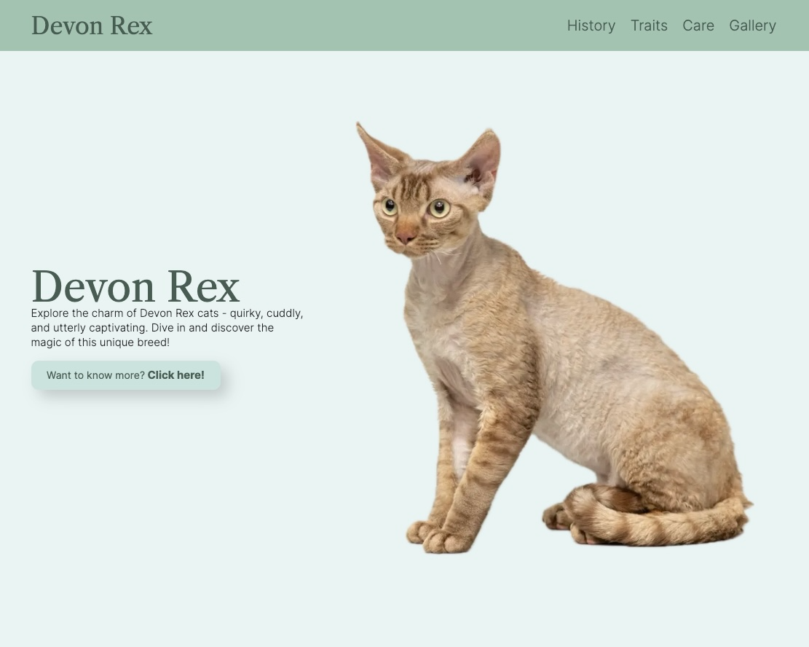|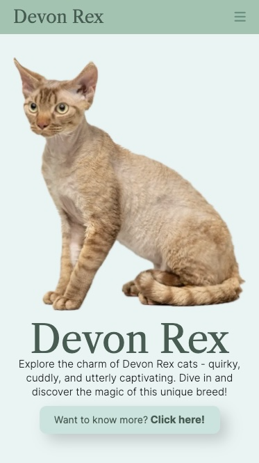|

### **History Section**

The "History" section of the Devon Rex website provides a detailed account of the breed's origin and development. It explains how the Devon Rex cat breed was discovered in Devon, England, resulting from a natural genetic mutation. The section traces the breed's history from its initial discovery to its recognition by cat fanciers and breeding associations. It highlights key milestones and significant figures in the breed's development, offering a comprehensive overview of how the Devon Rex became the beloved and distinctive breed it is today.
| Desktop | Mobile |
|-------------------|-------------------|
|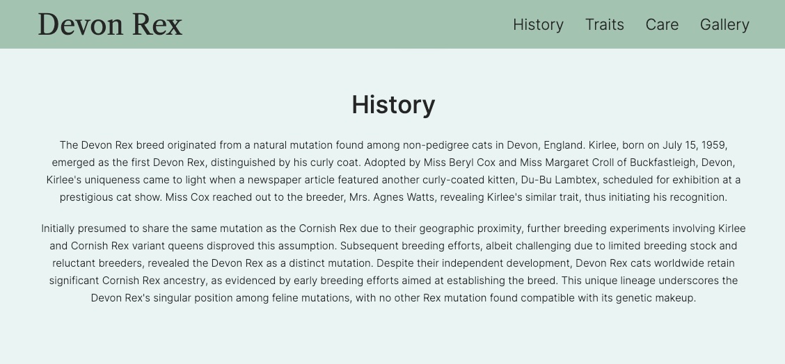|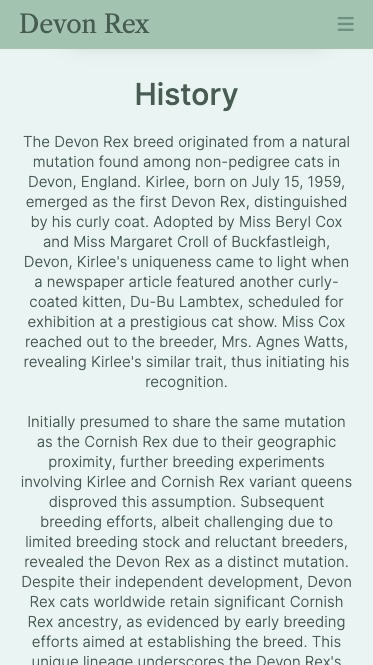|

### **Traits Section**

The "Traits" section is thoughtfully crafted to provide visitors with a comprehensive understanding of the distinctive characteristics of Devon Rex. Through concise yet informative descriptions, each trait is elaborated upon, offering insight into its significance and relevance. The section's design features a clean layout, making it easy to navigate and digest the content. Bold headings and bullet points draw attention to key traits, while the use of descriptive language ensures clarity and engagement.
| Desktop | Mobile |
|-------------------|-------------------|
||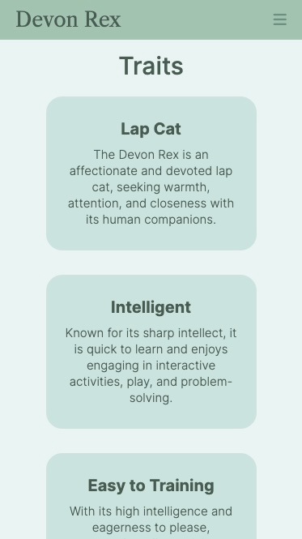|

### **Care Section**

The "Care" section is meticulously curated to provide Devon Rex cat enthusiasts with comprehensive guidance on nurturing and maintaining the well-being of these beloved feline companions. Through informative and practical advice tailored specifically to the needs of Devon Rex cats, each aspect of care is addressed, offering valuable insights and tips for optimal health and happiness. The section's design prioritizes user-friendliness, featuring clear headings and organized sub-sections for easy navigation. Rich visuals and illustrative graphics, showcasing the unique features of Devon Rex cats, enhance the content, making it visually appealing and engaging for visitors of all backgrounds.
| Desktop | Mobile |
|-------------------|-------------------|
|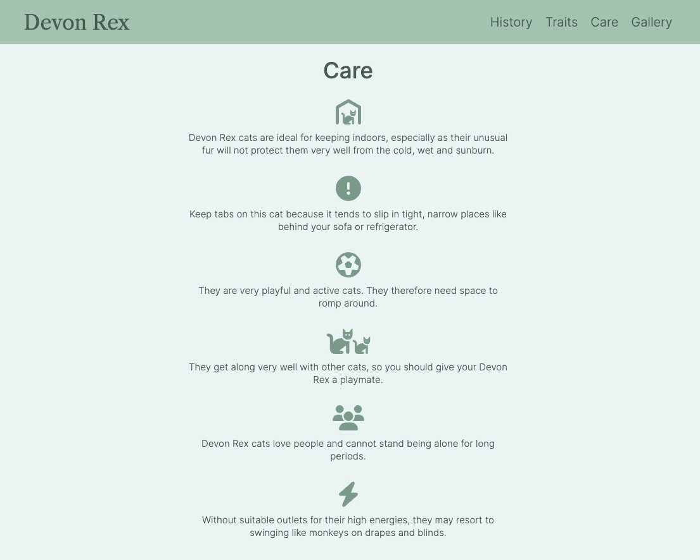|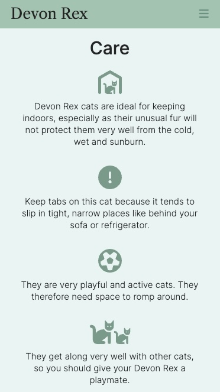|

## BEM Methodology

BEM (Block, Element, Modifier) is a popular naming convention for classes in HTML and CSS, originally developed by Yandex. It is designed to create reusable, modular, and maintainable code.

### BEM Structure

BEM divides the user interface into independent blocks, which can be reused across different parts of the application. The naming convention follows a specific structure:

- **Block**: The top-level component or a standalone entity that is meaningful on its own.
  - Example: `header`, `container`, `menu`
- **Element**: A part of a block that performs a certain function and has no standalone meaning.
  - Example: `header__title`, `menu__item`
- **Modifier**: A flag on a block or an element that changes its appearance or behavior.
  - Example: `menu__item--active`, `header--large`

### Naming Convention

The BEM naming convention uses a double underscore (`__`) to separate elements from their block and a double hyphen (`--`) to separate modifiers from blocks or elements.

- **Block**: `block-name`
- **Element**: `block-name__element-name`
- **Modifier**: `block-name--modifier-name` or `block-name__element-name--modifier-name`

### Example

```html
<div class="menu">
  <ul class="menu__list">
    <li class="menu__item menu__item--active">Home</li>
    <li class="menu__item">About</li>
    <li class="menu__item">Contact</li>
  </ul>
</div>
```

In this example:

- `menu` is the block.
- `menu__list` and `menu__item` are elements of the menu block.
- `menu__item--active` is a modifier that changes the appearance of the `menu__item` element.

### Benefits of BEM

1. **Clarity and Readability:** BEM makes it clear what each class refers to by looking at its name. It is easy to identify whether a class represents a block, an element, or a modifier.

2. **Modularity:** BEM promotes the creation of independent components. Each block is standalone, making it easier to reuse and maintain.

3. **Avoids Naming Conflicts:** The structured naming convention helps avoid class name conflicts, which are common in larger projects with many contributors.

4. **Improved Maintainability:** With BEM, the CSS and HTML structure is more organized, making it easier to understand, debug, and modify the code.

5. **Enhanced Scalability**: BEM's approach is particularly useful for large projects as it provides a consistent methodology for naming and structuring classes.

6. **Better Collaboration:** The clarity and structure provided by BEM make it easier for multiple developers to work on the same project without confusion.

## Testing

Responsiveness has been checked and adjusted in Chrome Dev Tools and the site has been viewed on mobiles and desktop without issues and the following browsers:

- Chrome

- Safari

- Firefox

### **HTML Validation**

All HTML code has been run through the [W3C - HTML](https://validator.w3.org/) validator. Results can be found below.


### **CSS Validation**

All CSS code has been run through the [W3C - CSS](https://jigsaw.w3.org/css-validator/) validator. Results can be found below.


### **Google Lighthouse**

The lighthouse score results can be found below.


### **WAVE Accessibility Evaluation**

The WAVE accessibility evaluation tool results can be found below.

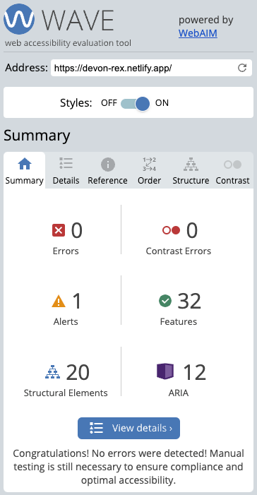

### **Manual Testing**

| Features          | Expected Outcome                                                                                                         | Test Performed                                          | Results                                                          | Pass/Fail |
| ----------------- | ------------------------------------------------------------------------------------------------------------------------ | ------------------------------------------------------- | ---------------------------------------------------------------- | --------- |
| **Navbar**        |
| Devon Rex         | When clicked, the page should scroll up to the top of the page                                                           | Clicked "Devon Rex" in the Navbar                       | Page scrolled up to the top of the page                          | Pass      |
| History           | When clicked, the page should scroll up or down to the History section                                                   | Clicked "History" in the Navbar                         | Page scrolled up and down to the History section                 | Pass      |
| Traits            | When clicked, the page should scroll up or down to the Traits section                                                    | Clicked "Traits" in the Navbar                          | Page scrolled up and down to the Traits section                  | Pass      |
| Care              | When clicked, the page should scroll up or down to the Care section                                                      | Clicked "Care" in the Navbar                            | Page scrolled up and down to the Care section                    | Pass      |
| Gallery           | When clicked, the page should scroll up or down to the Gallery section                                                   | Clicked "Gallery" in the Navbar                         | Page scrolled up and down to the Gallery section                 | Pass      |
| Contact           | When clicked, the page should scroll down to the Footer                                                                  | Clicked "Contact" in the Navbar                         | Page scrolled down to the Footer                                 | Pass      |
| **Footer**        |
| Devon Rex         | When clicked, the page should scroll up to the top of the page                                                           | Clicked "Devon Rex" in the Footer                       | Page scrolled up to the top of the page                          | Pass      |
| Instagram Icon    | When clicked, the instagram website should open in a new browser tab                                                     | Clicked Instagram icon in the Footer                    | A new browser tab was opened with Instagram web page             | Pass      |
| X / Twitter Icon  | When clicked, the X / Twitter website should open in a new browser tab                                                   | Clicked X icon in the Footer                            | A new browser tab was opened with X / Twitter web page           | Pass      |
| Facebook Icon     | When clicked, the Facebook website should open in a new browser tab                                                      | Clicked Facebook icon in the Footer                     | A new browser tab was opened with Facebook web page              | Pass      |
| Envelope Icon     | When clicked, the default email app should open in a new window                                                          | Clicked Envelope icon in the Footer                     | A new window was opened with the default email provider app      | Pass      |
| Sign Up Form      | When an invalid email format is entered, a warning message should be displayed                                           | Typed "user@" in the email input in the Footer          | A warning message was displayed                                  | Pass      |
| Subscribe Button  | When entering a valid email and clicking in the "subscribe" button, the user should be redirected to the subscriber page | Typed "user@gmail.com" in the email input in the Footer | User was directed to the subscriber page                         | Pass      |
| Tulio Minini Link | When clicked, should open the developer linkedin page in a new browser tab                                               | Clicked "Tulio Minini" in the Footer                    | A new browser tab was opened with the developer linkedin profile | Pass      |

### **Bugs**

### 1. Incorrect File Paths for CSS and Images

**Description:**  
When the project was first deployed, the links to the CSS files and images were not working. This issue did not occur in the local development environment but only after deployment.

<details>
<summary> Click to see images </summary>

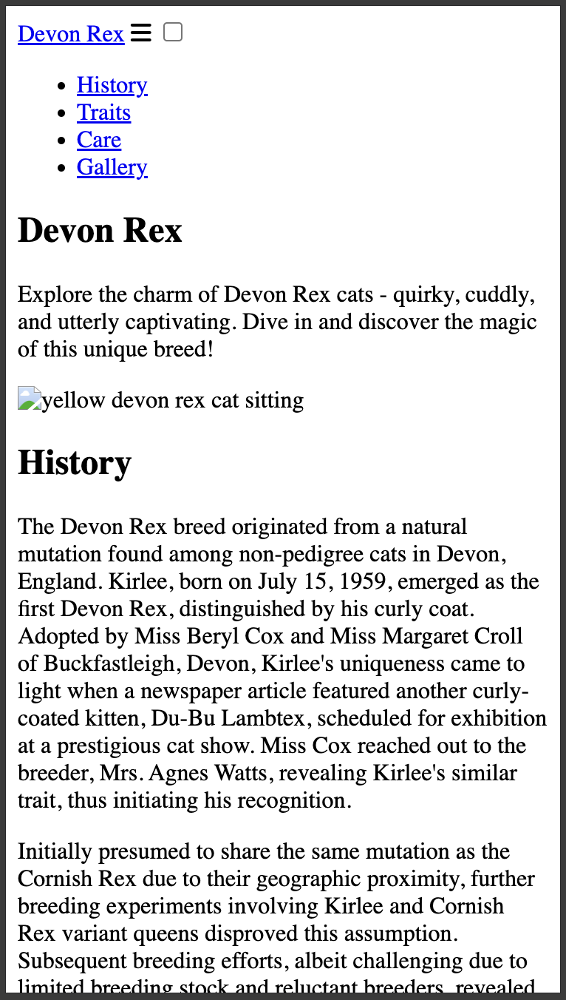
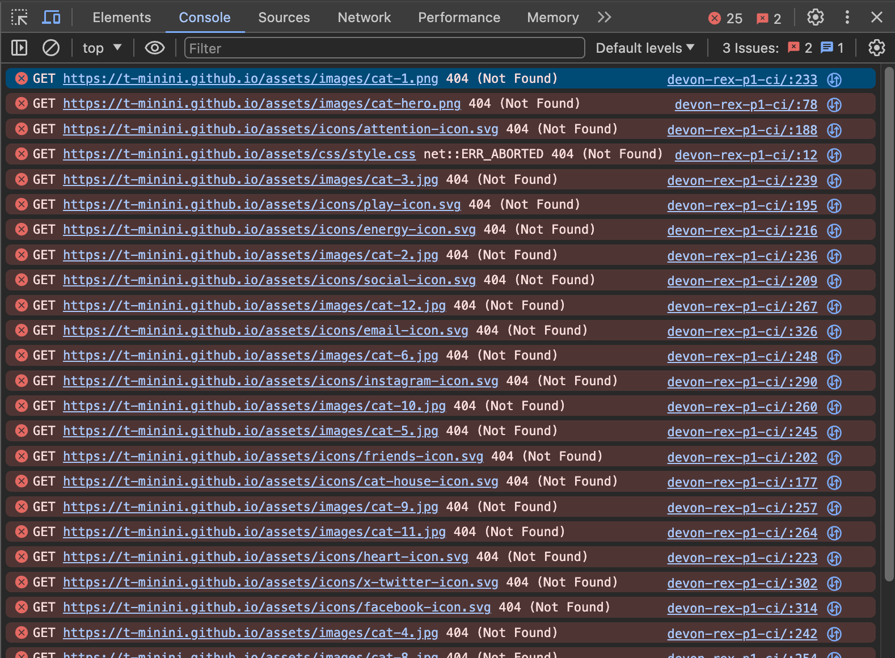

</details>

**Steps to Reproduce:**

1. Deploy the project to a web server.
2. Attempt to load the web page.
3. Notice that the CSS styles and images do not load.

**Expected Behavior:**  
The web page should correctly load all CSS styles and images as it does in the local development environment.

**Actual Behavior:**  
The web page fails to load CSS styles and images, resulting in an unstyled page with broken image links.

**Cause:**  
The issue was caused by the use of absolute file paths for the CSS and image links, which worked locally but not in the deployed environment.

**Solution:**  
Replace absolute file paths with relative file paths in the HTML files. For example, change paths from `/path/to/file.css` to `./path/to/file.css` or `path/to/file.css`.

**Example:**

Before:

```html
<link rel="stylesheet" href="/assets/css/style.css" />

```

After:

```html
<link rel="stylesheet" href="assets/css/style.css" />
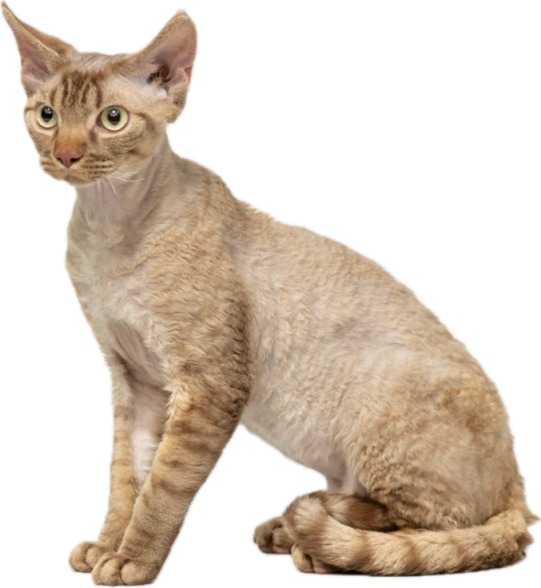
```

### 2. WAVE Image Not Appearing in README.md

**Description:**  
An image in the `README.md` file was not appearing because the file path was too long. This issue was resolved by shortening the file name.

<details>
<summary> Click to see image </summary>

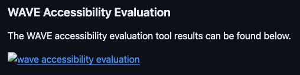

</details>

**Cause:**  
The issue was caused by the file path being too long. Some Markdown parsers or rendering engines have limitations on the length of file paths they can handle. When the file path exceeds these limitations, the parser may fail to properly render the image, resulting in it not being displayed in the `README.md` file.

**Solution:**  
Shorten the file name to ensure the image appears correctly in the `README.md` file.

**Example:**

Before:

```markdown

```

After:

```markdown

```

### **Test Final Review**

The testing procedures have been executed, meeting all specified criteria. Results have been thoroughly documented, and any identified issues have been addressed. Post-testing, the website has been confirmed to be fully functional and accessible.

## Tech Stack

This website is developed using the following technologies:

**HTML**: For structuring the content and layout of the web pages.

**CSS**: For styling the website and making it visually appealing.

## Tools Used

This website is developed using the following tools:

**GitHub**: Used for version control and code storage. GitHub allows for collaborative development, issue tracking, and code review, ensuring a smooth workflow and version management.

**Netlify**: Used to deploy the website. Netlify offers seamless continuous deployment and provides a range of features such as form handling, serverless functions, and a global CDN for fast content delivery.

**VS Code**: Integrated Development Environment (IDE) used to write, edit, and debug code. VS Code supports numerous extensions that enhance productivity, such as Git integration, syntax highlighting, and linting tools.

**Google DevTools**: A set of web developer tools built directly into the Google Chrome browser. Google DevTools provides features for debugging, editing CSS and HTML on the fly, and analyzing website performance.

**Google Fonts**: A library of over a thousand free and open-source font families. Google Fonts ensures consistent and aesthetically pleasing typography across different browsers and devices.

**Font Awesome**: A toolkit for using icons and social logos on your website. Font Awesome icons are vector-based, which makes them highly customizable in terms of size, color, and positioning.

**Figma**: A web-based design tool used for creating user interfaces and prototyping. Figma enables real-time collaboration, making it easy to gather feedback and iterate on design ideas.

**Balsamiq**: A wireframing tool used to create low-fidelity mockups. Balsamiq helps in quickly visualizing the structure and layout of web pages before moving on to high-fidelity design.

**W3C Markup Validation Service**: A tool provided by the World Wide Web Consortium (W3C) to validate HTML and XHTML documents. This service checks for errors in the markup to ensure compliance with web standards.

**W3C CSS Validation Service**: A tool provided by W3C to validate CSS code. It helps in identifying errors and potential issues in the stylesheet, ensuring it adheres to CSS standards.

**WAVE Accessibility**: A web accessibility evaluation tool. WAVE helps in identifying accessibility issues on web pages, ensuring they are accessible to users with disabilities.

**Google Lighthouse**: An open-source, automated tool for improving the quality of web pages. Lighthouse audits performance, accessibility, SEO, and other best practices, providing insights and recommendations for improvement.

**Prettier**: A code formatter that enforces a consistent style by parsing your code and re-printing it with its rules. Prettier helps maintain clean and readable code throughout the project.

**Birme**: An online bulk image resizing tool. Birme is used to resize images quickly and efficiently, ensuring that they are optimized for the web without compromising on quality.

**LinkedIn Post Inspector**: Post Inspector can help you identify the data missing on your page, and what you need to add for your content to have better previews in posts.

Each of these tools plays a crucial role in the development, deployment, and maintenance of the website, contributing to its overall quality and user experience.

## Credits

All images used in this project are credited to their respective authors. You can find the author information by hovering over each image, where the title attribute displays the credit.

Credits to: shutterstock.com @malee2, @Veera, Unsplash - @ivanlyah, Pinterest - @devonresale, @artiepaws, @estherbarcomb, @ruto_boomeowbooo, @anechka_mardar, stock.adobe.com - @aylabaha, @veera, @annaav, Getty Images/Canva Pro, Instagram - @devonrexsharing, TikTok - @user13663e.
