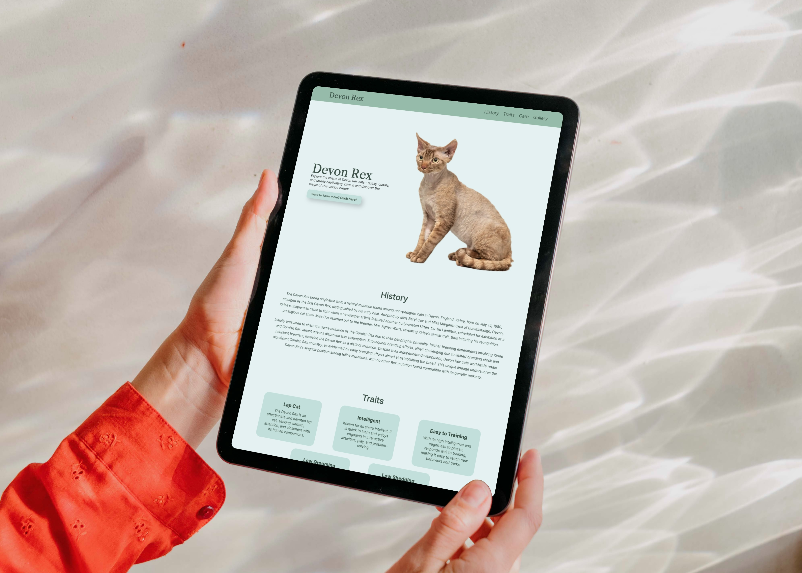

# Devon Rex 

## Description

Discover all things Devon Rex — history, traits and care tips for this enchanting cat breed. Your go-to resource for all things Devon Rex!

You can visit the live website [here!](https://t-minini.github.io/devon-rex-p1-ci/)

## **Design**

### **Colours**

### **Typography**

- All icons were sourced though [Iconify](https://www.figma.com/community/plugin/735098390272716381/iconify) Figma plugin and [Font Awesome](https://fontawesome.com/)
- All fonts were sourced through [Google Fonts](https://fonts.google.com/)
- [Libre Caslon Text](https://fonts.google.com/specimen/Libre+Caslon+Text)
- [Inter](https://fonts.google.com/specimen/Inter)

### **Wireframe and Prototype**

> [Balsamiq](https://balsamiq.com/) wireframe

 Open for desktop wireframe 

 

> [Figma](https://www.figma.com/) prototype

 Open for desktop prototype 

 Open for mobile prototype 

